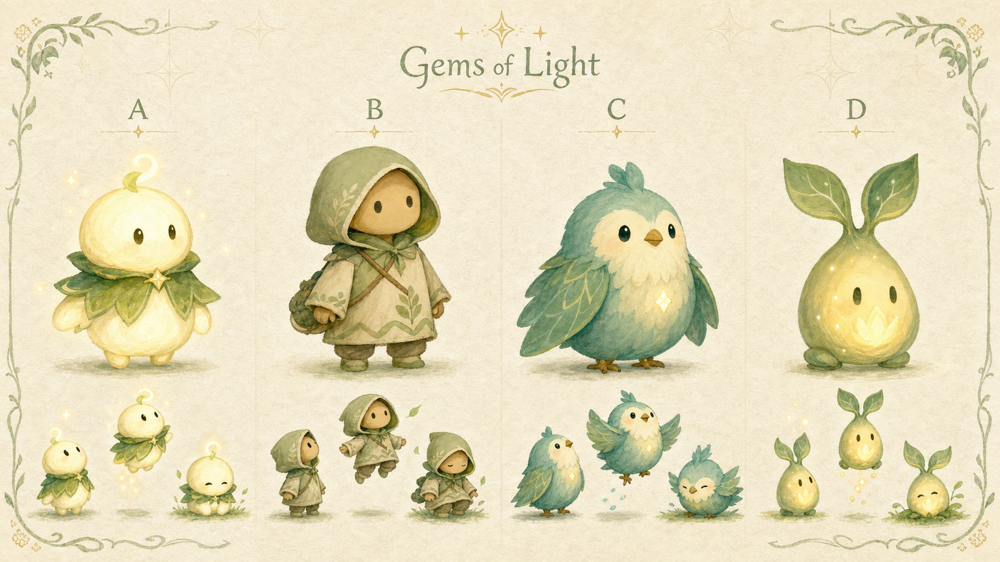
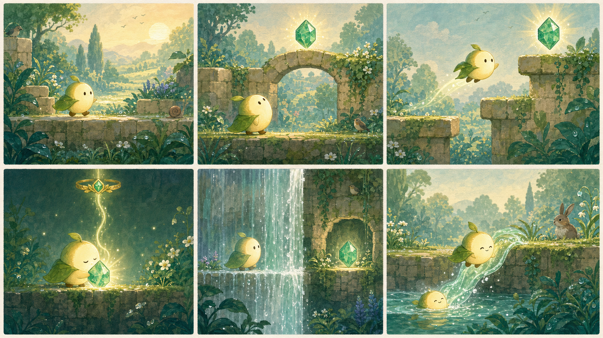
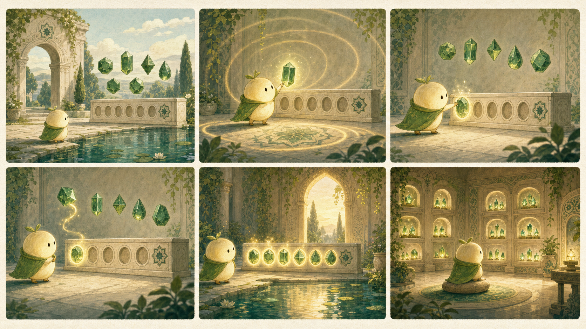

# Gems of Light — Storyboard Concepts

These boards translate the existing game brief into an initial visual direction: soft gouache, layered greens, warm cream stone, restrained gold, gentle movement, and no punitive feedback.

## Main-character options

- **A — Lightling:** A small round creature with a matte cream body, leaf mantle, and subtle inner warmth. Strongest match for the brief and the easiest silhouette to read at gameplay scale.
- **B — Child traveler:** The clearest human embodiment and strongest walking/jumping vocabulary, but less universal and more likely to create representation questions.
- **C — Moonbird:** Charming and expressive, but a flying animal weakens the logic of platform jumps and water recovery.
- **D — Lantern Sprout:** Distinctive, non-gendered, and nature-linked; its tall leaf silhouette is slightly less compact for mobile play.

**Recommended direction: A — Lightling.** Keep its body mostly matte cream and reserve the strongest brightness for the green ayah gems. The character can warm slightly during moments of discovery without competing with the gems' visual hierarchy.

## Storyboard 1 — Core gameplay loop

1. Enter the dew-wet Garden at an unhurried stroll.
2. A soft pulse draws attention to a gem above a low arch.
3. A long, forgiving jump demonstrates the platforming grammar.
4. Collection hushes the world while the gem's light enters the top band.
5. Exploration behind a waterfall reveals a safe hidden alcove.
6. Water gently returns the character to the bank, reinforcing that there is no failure.

## Storyboard 2 — Ordering gate and quiet reward

1. The player reaches the still courtyard and sees the collected gems above the settings.
2. Tapping a gem replays its ayah in a quiet listening moment.
3. A correct placement locks with a soft green-gold click.
4. An incorrect placement simply floats back; a gentle glow offers a hint.
5. The completed sequence illuminates in order and opens the arch.
6. The Recitation Room preserves every collected gem as a calm, replayable library.

## Final generation prompts

All three images were generated with the built-in image-generation workflow.

- **Character board:** Four equally polished, non-gendered gameplay-scale options — Lightling, child traveler, Moonbird, and Lantern Sprout — with hero and motion poses, on a cream gouache concept sheet with restrained geometric and vegetal ornament.
- **Core-loop board:** A six-panel Garden sequence covering arrival, gem cue, floaty jump, reverent collection, waterfall discovery, and gentle water recovery, using one consistent Lightling design.
- **Gate board:** A six-panel courtyard sequence covering listening, correct placement, compassionate correction, full ordered recitation, opened arch, and the Recitation Room, with all settings kept dignified and off the floor.

Shared constraints: no Arabic text or calligraphy, no sacred writing underfoot, no prophets, angels, sacred events, combat, punishment, score, timers, leaderboard, glossy 3D, hard black outlines, logos, or watermarks.
